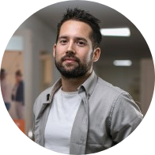
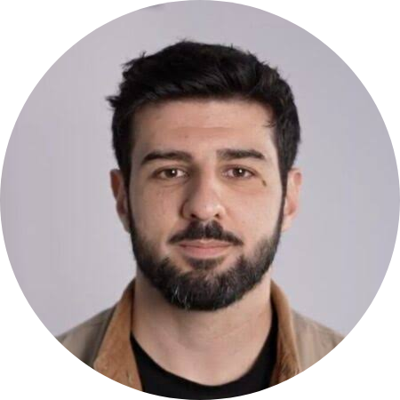

## Course Creator

{fig-align="center" width="150"}

::: text-center
**Pierre Catoire, MD, MSc**

*Emergency Doctor, Vice-President of Mehad*

Pierre Catoire developed the POCUS-CARE curriculum and authored the open-access textbook, with the objective of providing a structured, evidence-based ultrasound training programme adapted to conflict-affected settings.
:::

## Course Directors

{fig-align="center" width="150"}

::: text-center
**Mehdi El Melali, MD**

*Emergency Doctor, Board Member of Mehad*

Course directors oversee curriculum development and implementation, educational quality, instructor training, and continuous programme improvement.
:::

## Supporting Organisations

The POCUS-CARE initiative is supported by partner organisations involved in humanitarian health, medical education, and capacity building. Current supporting organisations include:

-   [**Mehad**](https://www.mehad.fr): implementation of the program in Ukraine, Palestine and Lebanon
-   [**MedGlobal**](https://www.medglobal.org/lebanon): implementation of the program in Lebanon
-   [**ANERA**](https://www.anera.org): implementation of the program in Lebanon
